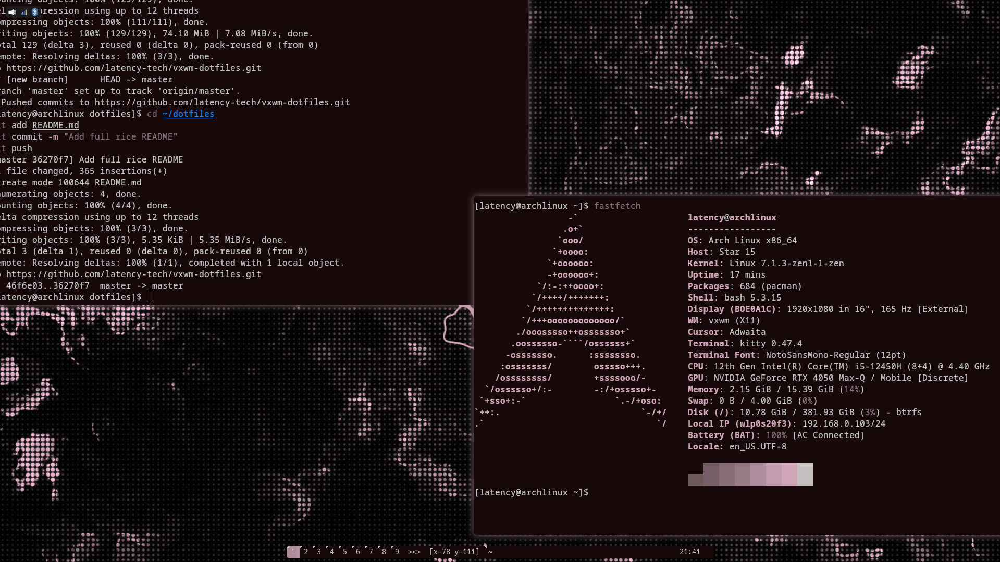
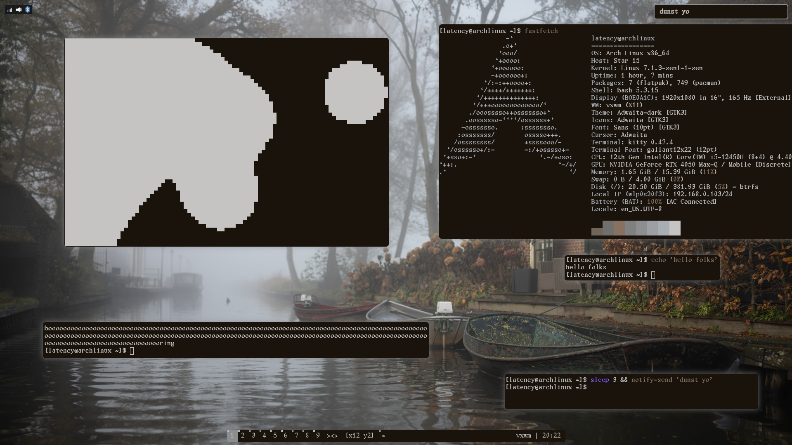
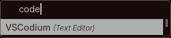
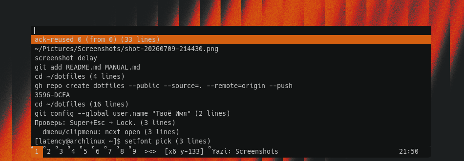
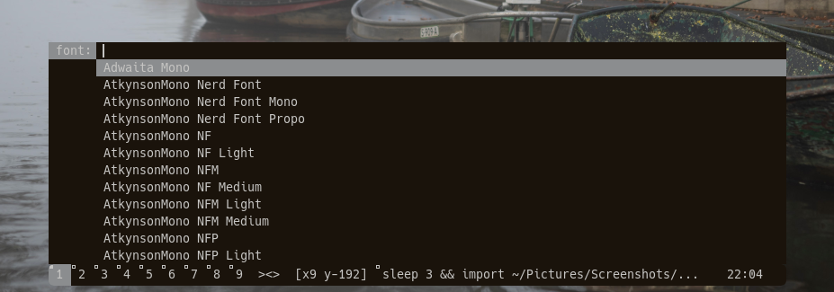
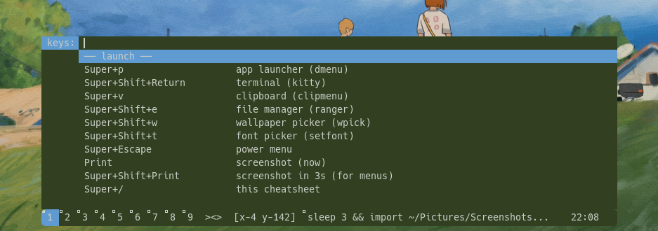
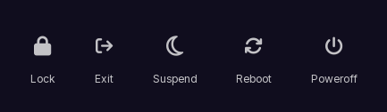

# kyka's vxwm rice

**Bar-centric minimal X11 desktop for Arch Linux** *(Fedora: experimental)*

Built around **[vxwm](https://codeberg.org/wh1tepearl/vxwm)** (modular [dwm](https://dwm.suckless.org/) fork) and one rule:

> **Everything looks like the bar.**  
> Launcher, clipboard, fonts, cheatsheet, power menu — same colors, same font, same pywal palette.

One floating **polybar** bar, **rofi** launcher, GTK popups (power menu, wallpaper wheel) styled to match — one visual language. Floating bar, infinite canvas, pywal from wallpaper.

---

## Table of contents

1. [Screenshots](#1-screenshots)
2. [Philosophy](#2-philosophy)
3. [Highlights](#3-highlights)
4. [Features](#4-features)
5. [Installation](#5-installation)
6. [First minutes](#6-first-minutes)
7. [Keybindings](#7-keybindings)
8. [Scripts](#8-scripts)
9. [Repository layout](#9-repository-layout)
10. [Customization](#10-customization)
11. [NVIDIA](#11-nvidia-optional)
12. [Troubleshooting](#12-troubleshooting)
13. [Credits & contact](#13-credits--contact)

---

## 1. Screenshots

Images live in [`screenshots/`](./screenshots/).

| | |
|--|--|
| [Desktop](#desktop) · [Another desktop](#another-desktop) | Full session |
| [App launcher](#app-launcher) · [Clipboard](#clipboard) | dmenu-above menus |
| [Font picker](#font-picker) · [Cheatsheet](#keybind-cheatsheet) | Super+Shift+t / Super+/ |
| [Power menu](#power-menu) · [Notifications](#notifications) | Lock · dunst + pywal |

### Desktop



**Desktop** — vxwm bar (tags · layout · `[x y]` canvas coords · title · `vxwm | HH:MM`), floating **kitty**, pywal palette from wallpaper, tray top-left (Network / BT / volume). Compositor: **picom**.

### Another desktop



**Another desktop** — same rice, different wallpaper; **gallant12x22** terminal font, foggy canal wallpaper, status `vxwm | 20:22`, dunst toast top-right, tray pinned on the infinite canvas.

### App launcher



**App launcher** — `Alt+Space`. rofi (`drun`), centered and anchored to the bottom of the screen, slide-up fade via picom, pywal colors.

### Clipboard



**Clipboard** — `Super+v`. **clipmenu** history, same geometry and theme as the launcher.

### Font picker



**Font picker** — `Super+Shift+t`. One family for bar, menus, kitty, dunst — bar (polybar) reloads live, no rebuild or restart needed.

### Keybind cheatsheet



**Cheatsheet** — `Super+/`. All binds in blocks; type to filter (`tag`, `vol`, `canvas`, …).

### Power menu



**Power menu** — `Super+Escape`. Centered popup, clickable icon buttons: **Lock** (betterlockscreen) · Exit · Suspend · Reboot · Poweroff.

### Notifications


**Notifications** — **dunst**, colors rebuilt on every `setwal` / `wpick` (urgency blocks from pywal template).

---

## 2. Philosophy

| Do | Don't |
|----|--------|
| One bar as UI chrome | Extra docks / multi-widget bars |
| dmenu/GTK popups matched to bar theme & pywal | Mismatched, ad-hoc app dialogs |
| Colors from wallpaper | Static multi-app theme packs |
| Infinite canvas + tags | Only rigid slide workspaces |
| Small shell scripts | Heavy DE services |

Menus sit **on or above** the bar (`dmenu-above`). Stock dmenu may flash full-width for a frame — accepted for stability.

---

## 3. Highlights

What makes this rice more than “dwm + pywal”:

| Feature | Why it matters |
|---------|----------------|
| **Infinite canvas** | Screen is a viewport over a continuous desk; pan, home `(0,0)`, pin windows (tray stays put) |
| **Bar-centric UI** | polybar shows tags, clock, wifi/bluetooth, tray, volume/brightness gauges directly — click wifi/bluetooth/date to act |
| **pywal end-to-end** | Wallpaper → bar (`colors-polybar`), rofi, dunst, picom shadow tint, **GTK3/Thunar** (`gtk.css`), betterlockscreen |
| **setfont** | One family for bar/menus/kitty/dunst; pick hides Noto spam; Cyrillic-aware fallbacks |
| **Media keys** | `vol` / `bright` update the bar's gauges directly (no popup notifications) |
| **Screenshots** | Region + swappy; delay 3s for open menus; restarts Materialgram if it was open |
| **Theme bounce** | `setwal` restarts Thunar/Materialgram **only if already running** |
| **Status** | polybar clock module: `weekday DD mon  HH:MM:SS` |
| **DPI lock** | 96 DPI in `.xinitrc` |
| **Shell choice** | bash / zsh / both — shared aliases in `shell-common` |
| **Install** | Arch full + Fedora experimental; `verify` after install |

---

## 4. Features

### Window manager (vxwm)

Upstream: [codeberg.org/wh1tepearl/vxwm](https://codeberg.org/wh1tepearl/vxwm) · mirror [github.com/wh1tepearll/vxwm](https://github.com/wh1tepearll/vxwm)

Toggle features in `modules.h` (`0`/`1`) instead of stacking patches.

**Enabled in this rice (among others):**

| Module / option | Effect |
|-----------------|--------|
| Infinite tags + coords in bar | Pan desktop; see `[x y]` |
| Pin window | Fixed on screen while canvas moves (tray auto-pinned) |
| Gaps | Spacing between clients |
| Floating + enhanced float | Restore size/position |
| Keyboard move-resize | `Super`+arrows move, `Super+Ctrl`+arrows resize |
| Better resize | 8-sided resize, edge cursors |
| Fullscreen, XRDB, windowmap | Fullscreen, pywal bar, fade-friendly tags |
| Bar height + padding | Compact floating bar (not edge-to-edge) |
| Tag-to-tag | Re-press same tag → previous tag |
| Center new floating windows | New floats appear centered |

**Compositor:** [picom](https://github.com/yshui/picom) only (`ZOOM` / vcompmgr **off**). Shadows & rounded corners; bar, tray, menus excluded from shadows.

### Bar-centric UI

polybar (floating pill, not edge-to-edge) is the UI — no internal dwm bar, no
tray applets running in the background. Left: brightness gauge + tags. Center:
clock. Right: cava spectrum, wifi, bluetooth, keyboard layout, tray, volume
gauge — **click** wifi to open `nm-connection-editor`, bluetooth for
`blueman-manager`, the clock for a calendar popup.

| UI | Bind | Notes |
|----|------|--------|
| App launcher | `Alt+Space` | rofi, centered, slides up from the bottom |
| Clipboard | `Super+v` | clipmenu |
| Fonts | `Super+Shift+t` | `setfont pick` (all fonts; Noto Sans/Serif filtered) |
| Cheatsheet | `` Super+` `` | Searchable keybinds, generated from `config.h` |
| Power | `Super+Escape` | GTK popup, centered, clickable icons — Lock · Exit · Suspend · Reboot · Poweroff |
| Wallpapers | `Super+Shift+w` | `wpick` wheel picker → `setwal` |
| Files | `Super+e` | **Thunar** (GTK themed via pywal) |

### Theming

- **pywal / pywal16** — palette from wallpaper  
- **`setwal`** — wallpaper + xrdb + polybar reload + dunst rebuild + picom shadows + **GTK3 css** + betterlockscreen cache + optional Thunar/Materialgram restart  
- **`setfont`** — bar / dmenu / clipmenu / kitty / dunst; multi-font bar fallback for missing glyphs (e.g. Cyrillic)  
- **GTK** — `~/.config/wal/templates/gtk.css` → `~/.config/gtk-3.0/gtk.css` (Thunar, Materialgram, …)  
- **DPI 96** — set in `.xinitrc`  

### Tray (in the bar, top-right)

`stalonetray`-free — polybar hosts an `internal/tray` slot directly. There's
no `nm-applet`/`blueman-applet` autostart: wifi and bluetooth are driven by
clicking their bar modules instead. The tray slot is only for apps that
minimize to it (Telegram/Discord-style).

### Media & capture

- Volume / brightness keys update the bar's gauges directly — no popup notifications  
- `Super+Shift+s` — region screenshot → clipboard + **swappy**  
- `Super+Shift+Print` — 3s delay full shot (for open menus) → swappy  
- After screenshot: **Materialgram** restart-if-running (GTK theme refresh)

---

## 5. Installation

| Path | When |
|------|------|
| **[Quick install](#quick-install-script)** | Auto-detects Arch or Fedora |
| **[Manual — Arch](#manual-install--arch-linux)** | Full control (canonical) |
| **[Manual — Fedora](#manual-install--fedora-experimental)** | Experimental |

Target: **X11** + `startx` (not pure Wayland).

### Requirements

| | Arch | Fedora |
|--|------|--------|
| **OS** | Arch / Arch-based | Fedora (experimental) |
| **Display** | X11 | X11 / Xorg session |
| **Theme** | AUR/`python-pywal` or `python-pywal16` | `pip` / `pipx` pywal16 |
| **GPU** | Any; NVIDIA → [§11](#11-nvidia-optional) after base install |

### Quick install (script)

```bash
git clone https://github.com/kyka-zavr/vxwm-dotfiles.git ~/dotfiles
cd ~/dotfiles
./install.sh
startx
```

The script asks **shell** (bash / zsh / both) and detects distro (`RICE_DISTRO=arch|fedora` to force).

| Env | Meaning |
|-----|---------|
| `RICE_SHELL=bash\|zsh\|both` | Non-interactive shell choice |
| `RICE_CHSH=1` | Also `chsh` when shell is bash or zsh |
| `RICE_DISTRO=arch\|fedora` | Force package path |

| Command | Does |
|---------|------|
| `./install.sh` | packages → services → configs → build vxwm → wallpaper → verify → help |
| `./install.sh deps` | packages + services |
| `./install.sh config` | configs & scripts |
| `./install.sh build` | rebuild vxwm |
| `./install.sh help` | post-install notes |

Aliases live in `~/.config/rice/shell-common` (sourced by bash and zsh).

### Manual install — Arch Linux

#### A. Base

```bash
sudo pacman -Syu
mkdir -p ~/.local/bin ~/.config
mkdir -p ~/Pictures/Wallpapers ~/Pictures/Screenshots ~/.cache/clipmenu

git clone https://github.com/kyka-zavr/vxwm-dotfiles.git ~/dotfiles
cd ~/dotfiles

grep -q 'local/bin' ~/.profile 2>/dev/null || \
  echo 'export PATH="$HOME/.local/bin:$PATH"' >> ~/.profile
source ~/.profile
```

#### B. X11 & build

```bash
sudo pacman -S --needed \
  base-devel git pkgconf python-pip rsync make \
  xorg xorg-xinit xorg-xrdb xorg-xsetroot xorg-xset xorg-xprop \
  xorg-setxkbmap xorg-xrandr xdotool \
  libx11 libxft libxinerama \
  libxcomposite libxdamage libxfixes libxrandr libdrm
```

#### C. Desktop stack

```bash
sudo pacman -S --needed \
  kitty feh dmenu clipmenu stalonetray picom dunst libnotify \
  thunar gvfs exo tumbler sxiv imagemagick xclip xsel swappy micro \
  brightnessctl \
  networkmanager network-manager-applet \
  bluez bluez-utils blueman \
  libpulse pipewire pipewire-pulse pipewire-alsa pipewire-jack wireplumber \
  pavucontrol alsa-utils python-gobject gtk3 \
  udisks2 ntfs-3g xdg-user-dirs xdg-utils \
  ttf-dejavu ttf-liberation noto-fonts \
  otf-atkinsonhyperlegiblemono-nerd \
  ttf-jetbrains-mono-nerd ttf-firacode-nerd ttf-hack-nerd
```

Do **not** install classic `pulseaudio` next to `pipewire-pulse`.

Lock screen (`Super+L`, power menu → Lock) uses **betterlockscreen**, AUR-only:

```bash
paru -S --needed betterlockscreen   # or yay
```

#### D. pywal

```bash
# official:
sudo pacman -S --needed python-pywal
# or AUR pywal16:
# yay -S python-pywal16
```

#### E. Build vxwm

```bash
cd ~/dotfiles/vxwm
make clean && make && sudo make install
cp -f ./vxwm ~/.local/bin/vxwm && chmod +x ~/.local/bin/vxwm

mkdir -p ~/vxwm
rsync -a --delete --exclude='*.o' --exclude='vxwm' --exclude='.git' \
  ~/dotfiles/vxwm/ ~/vxwm/
```

#### F. Configs

```bash
cp ~/dotfiles/.local/bin/* ~/.local/bin/ && chmod +x ~/.local/bin/*

mkdir -p ~/.config/{kitty,picom,dunst,wal/templates,gtk-3.0,rice,polybar/scripts,rofi,cava}

cp ~/dotfiles/.config/kitty/kitty.conf              ~/.config/kitty/
cp ~/dotfiles/.config/picom/picom.conf              ~/.config/picom/
cp ~/dotfiles/.config/polybar/config.ini            ~/.config/polybar/
cp ~/dotfiles/.config/polybar/scripts/*.sh          ~/.config/polybar/scripts/ && chmod +x ~/.config/polybar/scripts/*.sh
cp ~/dotfiles/.config/rofi/config.rasi              ~/.config/rofi/
cp ~/dotfiles/.config/cava/config                   ~/.config/cava/
cp ~/dotfiles/.config/dunst/dunstrc                 ~/.config/dunst/dunstrc.base
cp ~/dotfiles/.config/dunst/dunstrc                 ~/.config/dunst/dunstrc
cp ~/dotfiles/.config/wal/templates/*               ~/.config/wal/templates/ 2>/dev/null || true
cp ~/dotfiles/.config/gtk-3.0/*                     ~/.config/gtk-3.0/
cp ~/dotfiles/.config/rice/*                        ~/.config/rice/ 2>/dev/null || true

cp ~/dotfiles/.xinitrc ~/.xinitrc && chmod +x ~/.xinitrc
cp ~/dotfiles/.stalonetrayrc ~/.stalonetrayrc

# shell: bash and/or zsh
cp ~/dotfiles/.bashrc ~/.bashrc          # or merge
# sudo pacman -S zsh && cp ~/dotfiles/.zshrc ~/.zshrc

cp -a ~/dotfiles/Pictures/Wallpapers/. ~/Pictures/Wallpapers/ 2>/dev/null || true
xdg-mime default thunar.desktop inode/directory 2>/dev/null || true
```

#### G. Services & theme

```bash
sudo systemctl enable --now NetworkManager bluetooth
systemctl --user enable --now pipewire pipewire-pulse wireplumber
xdg-user-dirs-update

setwal ~/Pictures/Wallpapers/<image>.png
startx
```

Optional layout: `setxkbmap -layout us,ru -option grp:alt_space_toggle` in `~/.xinitrc`.

#### Checklist

- [ ] Packages + `wal`  
- [ ] Scripts on `PATH`  
- [ ] vxwm in `~/.local/bin`  
- [ ] `startx` → bar + wallpaper  
- [ ] `setwal` / `wpick` once  
- [ ] `Super+/` cheatsheet  
- [ ] (Optional) NVIDIA  

### Manual install — Fedora (experimental)

Same flow with **dnf**: `libX11-devel` `libXft-devel` `libXinerama-devel` `fontconfig-devel` `freetype-devel`, desktop stack (`thunar`, `picom`, `pipewire-pulseaudio`, `pulseaudio-utils`, …), **pywal via pipx/pip**, clipmenu from git if missing. Full package tables: see git history / previous README section or run `RICE_DISTRO=fedora ./install.sh`.

Use an **Xorg** session or `startx` from TTY — vxwm is X11-only.

---

## 6. First minutes

| Action | Result |
|--------|--------|
| `Super+Return` | kitty |
| `` Super+` `` | Cheatsheet (type to search) |
| `Super+Shift+w` | Wallpaper wheel picker → full theme |
| `Super+Shift+t` | Fonts |
| `Super+Escape` | Power / **Lock** |
| `Alt+Space` / `Super+v` | Launcher (rofi) / clipboard |
| `Super+e` | Thunar |
| `Super+r` | Canvas home `(0,0)` |

---

## 7. Keybindings

**Super** = Mod4 · **Alt** = Mod1 · In-session list: **`` Super+` ``**

### Launch

| Key | Action |
|-----|--------|
| `Alt+Space` | App launcher (rofi) |
| `Super+Return` | Terminal (kitty) |
| `Super+v` | Clipboard |
| `Super+e` | Thunar |
| `Super+w` / `c` / `s` | Chrome / VSCodium / Spotify |
| `Super+Shift+w` | Wallpaper wheel picker |
| `Super+Shift+t` | Fonts |
| `Super+Escape` | Power menu |
| `` Super+` `` | Cheatsheet |
| `Super+Shift+s` | Region screenshot → swappy |
| `Super+Shift+Print` | Delay 3s full shot → swappy |
| `Super+F5` | Reload pywal colors everywhere |

### Windows

| Key | Action |
|-----|--------|
| `Super+j` / `k` | Focus next / prev |
| `Super+Tab` | Focus next (same as `j`; recenters canvas on it) |
| `Super+-` / `=` | Master size |
| `Super+i` / `d` | Masters ± |
| `Super+l` | Lock screen |
| `Super+q` | Close window |
| `Super+Shift+q` | Enhanced float toggle |
| `Super+Shift+Alt+space` | Float toggle (plain) |
| `Super+Shift+f` | Fullscreen |
| `Super+arrows` | Move window |
| `Super+Ctrl+arrows` | Resize window |

### Layout

| Key | Action |
|-----|--------|
| `Super+Shift+Alt+t` / `f` | Float / tile layout |
| `Super+Shift+m` | Monocle |
| `Super+Shift+space` | Toggle floating / tile |

### Tags

| Key | Action |
|-----|--------|
| `Super+1…9` | View tag |
| `Super+Shift+1…9` | Move window to tag |
| `Super+Ctrl+1…9` | Toggle tag in view |

### Infinite canvas

| Key | Action |
|-----|--------|
| `Super+r` | Home `(0,0)` |
| `Super+Shift+arrows` | Pan (keyboard) |
| `Super+Shift+d` | Center window |
| `Super+Ctrl+z` | Pin window |
| Drag empty desktop | Pan (plain left-click drag) |
| `Super+Shift+drag` | Pan (works over any window too) |
| `Super+click1/2/3` (on a window) | Move / toggle float / resize |

### Media (no modifier)

| Key | Action |
|-----|--------|
| `Vol±` / `Mute` | Volume — bar gauge updates directly, no popup |
| `Bri±` | Brightness — bar gauge updates directly, no popup |

### Session

| Key | Action |
|-----|--------|
| `Super+Escape` | **Lock** · Exit · Suspend · Reboot · Poweroff |
| `Super+Ctrl+Shift+q` | Quit vxwm |

---

## 8. Scripts

| Script | Role |
|--------|------|
| `dmenu-above` | Shared dmenu, docked under polybar |
| `cmwrap` | Clipmenu, via `dmenu-above` |
| `cheatsheet` | Searchable binds, generated from `config.h` |
| `powermenu` | GTK popup — Lock / Exit / Suspend / Reboot / Poweroff |
| `setwal` | Wallpaper + full theme cascade (bar, dunst, picom, GTK, betterlockscreen) |
| `wpick` | Wallpaper wheel picker (GTK, cached thumbnails) → calls `setwal` |
| `setfont` | Global font (`setfont --help`) |
| `vol` / `bright` | Media keys, update bar gauges directly (no dunst popups) |
| `picomlaunch` | picom + wal shadow color |
| `screenshot` | Capture + swappy + Materialgram bounce |
| `restart-if-running` | Kill+relaunch only if process was up |
| `install-nvidia` | Arch linux-zen + nvidia-open-dkms |
| `walapply` / `walcolors` | Theme helpers |

```bash
setwal ~/Pictures/Wallpapers/foo.png
setfont pick
setfont list          # fonts (Noto Sans/Serif filtered)
setfont list raw      # everything
screenshot delay 3    # open a menu before the timer ends
```

---

## 9. Repository layout

```text
.
├── install.sh                 # Arch + Fedora (auto-detect)
├── README.md                  # this file
├── MANUAL.md                  # pointer → manual sections
├── screenshots/               # gallery
├── .xinitrc                   # session: DPI, tray, picom, dunst, vxwm | clock
├── .bashrc  .zshrc  .stalonetrayrc
├── .config/
│   ├── kitty/  picom/  dunst/
│   ├── rice/                  # font, tray icons, shell-common
│   ├── gtk-3.0/               # settings + gtk.css (from setwal)
│   ├── polybar/  rofi/  cava/ # bar, launcher, spectrum module
│   └── wal/templates/         # XRDB, dunst, gtk.css, rofi colors
├── .local/bin/                # rice scripts
├── Pictures/Wallpapers/
└── vxwm/                      # WM sources (rice config + modules)
```

---

## 10. Customization

| Goal | Edit | Then |
|------|------|------|
| Keys / bar / rules | `vxwm/config.h` (`vxconfig`) | `vxbuild`, restart X |
| WM features | `vxwm/modules.h` (`vxmod`) | `vxbuild`, restart X |
| Shadows | `~/.config/picom/picom.conf` | restart picom |
| Notifications | `~/.config/dunst/dunstrc.base` | `setwal` |
| Terminal | `~/.config/kitty/kitty.conf` | reload kitty |
| Autostart | `~/.xinitrc` | restart X |
| Font (bar/menus/kitty/dunst) | `setfont` / `~/.config/rice/font` | applies live, no rebuild |
| Bar layout / modules | `~/.config/polybar/config.ini` | `barlaunch` |
| GTK theme | wal template `gtk.css` | `setwal` |

```bash
alias vxbuild='cd ~/dotfiles/vxwm && make && sudo make install && cp -f ~/dotfiles/vxwm/vxwm ~/.local/bin/vxwm'
alias vxconfig='micro ~/dotfiles/vxwm/config.h'
alias vxmod='micro ~/dotfiles/vxwm/modules.h'
alias x='startx'
```

`vxbuild` + restarting X is only needed for **vxwm** changes (keybinds, rules, WM behavior) — `config.h`/`modules.h` are compiled in. Everything else (bar, launcher, menus, terminal, notifications, fonts) reloads live.

---

## 11. NVIDIA (optional)

### Arch (linux-zen)

```bash
install-nvidia
reboot
nvidia-smi
```

Manual: `linux-zen-headers` `dkms` `nvidia-open-dkms` `nvidia-utils`, blacklist nouveau, `nvidia_drm.modeset=1`, `mkinitcpio -P`, DPI 96 in `20-nvidia.conf`. See script `install-nvidia`.

### Fedora

RPM Fusion + `akmod-nvidia` (not `install-nvidia`). See [Fedora NVIDIA docs](https://docs.fedoraproject.org/en-US/quick-docs/how-to-set-nvidia-as-primary-gpu-on-optimus-based-laptops/).

After drivers work you may try `backend = "glx"` in picom (default rice: `xrender`).

---

## 12. Troubleshooting

| Issue | Fix |
|-------|-----|
| `startx` fails | Xorg log + GPU drivers; use **local TTY**, not root |
| `twm` / `xterm not found` | You ran `startx` as **root** — use your user + `~/.xinitrc` |
| Only console users | Full logout from DE; login on TTY → `startx` |
| No Wi‑Fi icon | NetworkManager + tray after stalonetray |
| No sound | `systemctl --user restart pipewire pipewire-pulse wireplumber` |
| Bar colors stale | `Super+F5` or `setwal` |
| Bar font unchanged | `setfont "Family" size1 size2` or `setfont apply`; check `~/.config/polybar/config.ini` `font-0` |
| Menus missing | `~/.local/bin` on PATH; run `setwal` once |
| Huge UI after NVIDIA | DPI 96 in `.xinitrc` |
| dmenu full-width flash | Expected; then snaps to bar |
| Screenshot open menus | `Super+Shift+Print` first, then open menu |
| Thunar not pywal-colored | `setwal` once; check `~/.config/gtk-3.0/gtk.css` has `#hex` not `{background}` |
| `wal` ImageMagick palette | Try another image / backend; core install still OK |
| Fedora: package missing | `dnf search`; install.sh uses skip-unavailable |
| Fedora: Wayland session | Switch to Xorg or TTY `startx` |

---

## 13. Credits

### Software

- **[vxwm](https://codeberg.org/wh1tepearl/vxwm)** by wh1tepearl — modular dwm fork  
- **polybar** · **rofi** · suckless **dmenu** · **picom** · **dunst** · **kitty** · **pywal** · **clipmenu** · **thunar** · **swappy** · **betterlockscreen** (i3lock-color)  
- Optional aesthetic: [dim13/gallant](https://github.com/dim13/gallant) (Sun Gallant console typeface)

### Maintainer

Personal rice, maintained by **kyka**. Scripts, GTK popups (power menu, wallpaper wheel, calendar), bar layout, and vxwm keybind/rules config in this repo are custom.

---

*Rice scripts and configs: free to use and modify.*
